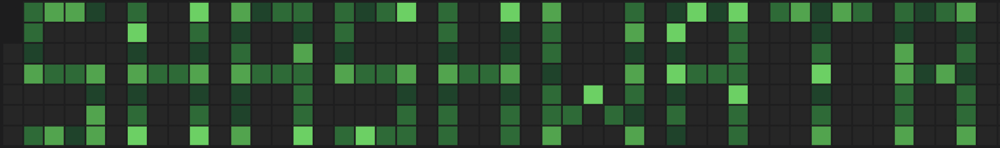

<h1 align="left">Hey, I’m Shashwata! 👋 </h1>

[![Website](https://img.shields.io/badge/Website-000?style=for-the-badge&logo=data:image/png;base64,iVBORw0KGgoAAAANSUhEUgAAADAAAAAwCAYAAABXAvmHAAAABGdBTUEAALGPC/xhBQAAACBjSFJNAAB6JgAAgIQAAPoAAACA6AAAdTAAAOpgAAA6mAAAF3CculE8AAAABmJLR0QA/wD/AP+gvaeTAAAAB3RJTUUH6QMGCAAopPI8pAAAC0FJREFUaN7tmFmMHNd1hs+591ZXLzPdPTvJEUVS4FggOaTERSQVi6REibFlWLRkK4gCJFKUIIgcPQQxbQXSS+InO5KyGBDiIAmQwLAjJ7aZWAggy0xigZQdEabEGS4zQ86Qs/TeXd3VXV171b0nD4QCBAYo9pCSEYA/UC+FQtX3n/NX3XML4LZu67b+Xwt/mQ+3LAuEJlBJRYjIbNsGPakrUoTnzp+jQwcP/bLr84u6urgIvu8jEeHUmfcwimMWhKFYLixjuVqBaq3aU1E/lg6YZgtSqTQ2qjXKDuQxlU4j44wxRHJsRwEAcc7XWl0rp+v6HCli5y9cUIcOHvzQe4uPCnp2bg42bNiAqWQSAICiOMa1d94hGDKFABIACABITyTWcE17rtFo/LrRMJ5ChqDrOiglP47a/qKazSYEYYhEhEQEsZRcKimICD44F8XxmljKZ6SUP4yldIqlYvTfp989/P7UWZi9NMdffvXVG07GLY2Q4zqQTCYRAIlIMQBgQCAZYwQAaxHxCUX0OSL6pCKVYYxBuVzuzM7MfIoLcXp83bgYGhqKwyDAywvzdPjBhz4eA6dPn4adu3YhKSKlFGoJwYlACc4VAEwQ0QtBGDwVxXEf5xwQkTjnqtFo0Pzly48xxn+Uy+e04eHhSMYxzs8v0CMPP/zxdMCyLEhn0oiIRIoYADDOeQwAg0T0J67n/b7t2HoYhhAEgcpk0mpwcAhN0+QLCwu/lc1mv61pmjY+Ph4ZhoEryyv00IMP3vDzb8qAaZqQzWURCIiIGAGh4EICwOOe73+z27XWuJ5HYRhitVq14yjmDxx4QDcMg5XL5T8eGxt7OY5ibdPGjdGVxavYaDTo/n37e2Jgq4XvWB3I5nLX4AH44d/9AgkuuJTymy3T/NdavTbWMk0wDANmZ2Zfa5udP9y9Z09kGAYrFouvrFs3/rKMpTh56lSMiLC8tAy9wq+6A1bXgnQqjQRAiCg4YzEAjPuBf9xst/d6nkue50Or1Tp+bvr8V57/gy+6BPBOuVLeXCgUXhlbM/oCAorLl+allJIymQweOniQVsPSs4FyuQwjo6MIAIQInDMuAWCz4zpvtUzzriiKwHXdy7Vq7bn99+/7SSKhj0kpT9VqtYlSqfTS8NDw1xhDUa5UZCKRIMYY7rtv76rgAVYRoZHRUQQEQsQP4O+y7O6JlmneFYYhWFbnu9Nnp3Zns/0/aXeslJTyjVqtNlEoFJ7WNO1rURRqtVpdalqCEBHPnPn5quF77oDruqhIUTKZYpwxBQBDtuOctLrWVt/3wTTNv9y9c9eXHM8RmVQm9gL/eKvVemRmZuZwQtfP5HM5zbKsmDFGnHO8f9/+m4LvSa+//jpIJZGIcGZ+jj353G+D63n/XmvUaWllmd47+/4/tzttqNZruuv70LY6xyq16sIPjh8fe+ONN2ClWEj6YSBCGV874lC4vseCKIQwjrBjdT7aDti2DUSAXOOcMx4zxBc6VufPwiiEVssslYrFnYVCsTG5fZJXqw157z2Tj5fK5bc1obWlkv+n2n4YIBAQIGAcx0zTNAkAaHU6NDI88tEYICKQSjLOrq2ujuu857huxvM8ZnWsF8IoemV8fF1yzehYiIjUbrezff19uSiKU4xhnyLKA8AYEfUxxhRnrBxG8U/1pN5xbJtFYagIAEeGhnuK1Q1Po47rop7UmSSlgOA5pVS/polAyoQ+ODTYBgBQSsXLxSLMXLpEzVbrCcdzvzEwMNBPiKgJDRhe+2YoIlBKAees7nvubwjB/0vTMtzqdlVP5e/FQBD4oOkJAiJQsdwCiMC5EJmMACHE1xniYUAQjPFRABhGxH4ASGtcoAKSYRhJz/MojiPinHMuOEPAUSD6luf7OxCxpQnB4NqYfesNKKXA7naRlAJkbJkxBolEQgIAcM4HhNCeIiAAAuAMgQDA83yot+tgWRYPgoBLKYExBslkEgYGBiCp63EUReNhEBxExH+LoogBQE9duGEDI8MjVCgWFLs2TX418IM9QvA9WiJBAIBxHAMAACKC7/tgWRZ4nkdSyhXG2FXG2DwClhAhk8lkfpMxto4AIIwi8INAQwBgnPcYoB4MmO02CMHV/PwC/uyn71TvuffeA6l0+mkgOgoAW3L5/KBS6kqr2Zrv2t2LSqkL3W7353vv29sZHx93OWOqWqsJRSqOouhsKpl6PYojDMNAuq53kUiBrus9rws3/BX62bkp2DQ6hnAtowwRodu2KdOfJs75+kQiERLDmhACO2YLOBeUyWT2RVGkpVPJdy4vXNFy2ZxYf+d6z3XdV4XQjrXbJpim+eM77lj3qXQ6w6anztGe3bt7MtHTSjx7aRZkrBCACBlDKSXv6+ujTRs2KgCAKIqE0LQIALKNRuPFIPCvDg0N/52UCgkUk1JKBNieTKVOh2GYqlar0Dbbh5RSJxN6gmf7s2pi8+aeDPQ0C225ewtMbttGlUoFMukMbN82KTdt2Ci7dpe3Ox3hB0EUBsEjhmH8oNPpvLv+jvX/0LW7R/v7MpTt61ee4yb0ZPJvASDVarXAcexX8wP5k6Njo/zMe2eU7di95Wc1qtVqEMYRKlIgSWEYhR9s2IXjun9TqVbOnb9w4RMrhRVotc2/WCmsPLO8sgxEBI7n/lMYR1Qsl2jq3PRbY6NrGBHhWyd+jOcunMeTp071zNNThBzPhaSuX9u0K8ViGXM9oUcAMGl1rbeazdbC7OzcY/vv328lk/ozjm1/ZXRkdEejaah0Ov1aIqE/32waUK1Up+uNxkNLS8vm5ORWpoiU4Bz3793X80t8wxEKohDTyRS89OUXKYoiUTPqEERhJJX8o4ZhnC8UCt/ZtHHjoa2T2618Lj8YRdFf24793VqjrtKp9Gu6rj/fajWhUq5M1ev1T3faprl9+zYuhFCCc5yemv5oNjQNowH5XB6FEAQAaDs278v0xQAw6rjO941m875SqfT5ocGhN4dHhpNDA4O+63t/7jjOl4IgeHF0dPROIcQX6/U6VCqV/2w1W5+fnp62Dhw8wIXQpFIKi8UCPX70c6vhh+uuHF3bBiUVep5HURyxdrvDs9lcjIhfMJrGu+VyeerNN3/0K9Vq7eLExOZEf39/4LrOBDL290opbXBw6GFNaHtKpRKWy+XvrRRWnvzMpx/1GGdcaJpUSmK9XqOjn31sVfDX7UCtXodqpYKAQGvXruUjwyMSAFjX7n6j2Wo9XSwUf2/37l3/opTiC1eu4N133w2MsTgMw1cYY1/mQgSklF4oFMAwjD+9Z8fur7ZadV6ulEnTNEVE2DSa9KtHjqwa/kMjpJRCo9lETdOUEGJLt9v9ummahRP/ceKlfD5v7dy5U4RBqCY+MUGLi0tkO05i29Ytc0rJTUEQgmEYpXa7/SwCnujP9oswDBVjTAEB+r5HBx44cFPw141QpVrBrtVFRFRKqU+apvlr5VLpr7LZ7D/u2HFPnM1m+dtvvy1t26Hh4UHstDssnU7HUsqJer0+Ua/Xv1Wv15/0ff9iLp8TcRRJACJExHbHpMMPHr5p+Ot24OriVcwPDFA6nWaFlcKdKyvLRcNoxrt27RTFUklxzlUymUSjYdBnHn0Ujh07hpqmURxL3Lpli/bs7zwbLlxZwK5ts7VjY3LN2Bo8c/Z9uG/3nlu6D75uhIgIZufmEAAol83yWq1GQ8PDinOOszMzcOTIEQIAWFxe/GBGwkymDy9cvKAG8gPc8zxCQMU4Q9/36dCBD//ff8sMLC0v49DgICVTKVxaXMTFpSXijJGeTGKr2aSjR4/+77UnT50EZAwRkRARgQhc1wPGkJAx7HTb9MRjT9xy+Nu6rdu6rdu6af0PDYlh2keZR48AAAAldEVYdGRhdGU6Y3JlYXRlADIwMjUtMDMtMDZUMDg6MDA6MjMrMDA6MDCeHLDyAAAAJXRFWHRkYXRlOm1vZGlmeQAyMDI1LTAzLTA2VDA4OjAwOjIzKzAwOjAw70EITgAAAABJRU5ErkJggg==&logoColor=white)](https://shashwatahalder.com/)

  
 
 
 
<h3 align="center">🚀 Software QA Engineer | Automation Engineer | QAOps Enthusiast </h3>
<h4 align="center">"Breaking Bugs, Automating Dreams & Engineering Quality!" </h3>

### 🎨 **About Me**  

🔹 Passionate about **test automation**, **CI/CD**, and **ensuring software quality** 🚀  
🔹 Experienced in **web, API, and mobile test automation** using **Playwright, Cypress, Selenium, and Appium**  
🔹 Skilled in **JavaScript, TypeScript, Python, Java** and building scalable **QA automation frameworks**  
🔹 Love to **mentor and share knowledge** in the QA community 👨‍🏫  

<!-- --- -->

### 📌 **Tech Stack & Tools**

 
 
 
![Java](https://img.shields.io/badge/Java-ED8B00?style=flat-square&logo=data:image/png;base64,iVBORw0KGgoAAAANSUhEUgAAACQAAAAwCAMAAABOmSgnAAAAYFBMVEVHcEz9/f39/f39/f39/f39/f39/f39/f39/f39/f39/f39/f39/f39/f39/f39/f39/f39/f39/f39/f39/f39/f39/f39/f39/f39/f39/f39/f39/f39/f39/f39/f2DSJEZAAAAH3RSTlMAAw73CPBo216wv+YUSnP7VMnSNSwaoiRCmX09Ho+G8zFqAgAAAm5JREFUOMuNVduioyAMFOR+F9R6z///5QL2tN2ztd28KWMymUywad4EuTXfgzD8HyCZvmJQr8N30AziK4i17fQNIyhE860zCuA+Y/DRAqicCG02DO8x2wgAOjWDkFpZ9BbTq4yhgbAIMG/v8/RdwQgzeqCOXNQqmJbhXFKLaw0BvGuEh/ZSzF5n0I6IBBjRFch6gG5oNv5Jp6mtp7eccL8EDRy8zXJm+vzadcdZx2VqxyVoi6CyJU1Opa9TWVrqNVMeMfvkJElOwZYPnnS6pArgL/xLMCYNYmNmxapZykf4uTboFpZRHracTKkxquvr63WM3XKHDbP2wMP9CTXBmQaR4YaTUGVQ9fWShYHogp3WdZ1sYGzZR6VCPjUKdH92XiZbHNDm8P586M6FcXUKdf5ORq5pwVCqeSd3Zu/7ssBzvRCe9rBO05r6m8FPo2D1Kr7gen12O6z3RREtzI9Pion46ESwQbhd8rYLxeOJQ/dMRHZ6cv/hTWVfFsPLl0kjtC4yZu6+LcxHlrJqScrwa2ewELc0TVPqB2IKD7L2v9dqkKCSwdhsSezd/I+fiDGkEYUIj0WvOgD7FyQdKkZpUwfPaPl+DsOsVQCWZ8JdLj+IWUXOeVTjYn/ukxuva1qSs0fdYRvMC1u8n9sVyzDt25ttCApondxUb4luZ1M/YIJKEGK23roxTyEWG+dOtyW2lWwWUckamVthQZXLdxQKsrZgi9rtS3eecjVX1VE/P64hYm5rYG45jmNxLOTS5Px81JqhhzfW3pC/FU5ijp6OL38QnNg+z3tOI4Rg7hgVp552RyK/f2B5sRTXrX8lVeIPLbYyyYUbV94AAAAASUVORK5CYII=&logoColor=white)
![Playwright](https://img.shields.io/badge/Playwright-2EAD33?style=flat-square&logo=data:image/png;base64,iVBORw0KGgoAAAANSUhEUgAAADAAAAAwCAMAAABg3Am1AAAB41BMVEVHcEwurTMpqS0noSwurTMurjMurDMlQVQfgykyRVIhfC0djSIsR1EurjJfdkVvSk4SQlQoRFLWU0kpQVQlajotnDcurTMdjiLWU0gwRlEuqjTWU0gsQ1IqSU84RlEsQ1ItaUdsRlEtRlIqejwllysurTMurTPaU0nbVEkoRFLWU0g3RVHcU0cxQ1MsTk4urTPVU0gdjiIuiT4dkCIupTUulDotRFLQUkgdjSIsRFMwRlGlT0supzUurTMurTMurTMurTMfjSW3UEourTOFTE1lSU4ghCodjSIdjiJYSE8qXEeeWzuBTkkpcD0tSFGfTksutTEurTOYTEpLRlHQUkjbU0ltSU4urTMtrDIekiIekCPWU0gtRFItQlMtQ1MdjSMuhz4tdEQtb0UnnywdjiLiV0wurTMejiMtX0odjiI7RlFDR1EjdDSETE2cTkwmZjzeVksggiohfS4mZj0ugz8tYkohfi0uqjQtb0UsS09mT0erUEsdjSIurTPWU0gcjiEurjPZU0jTU0jhVkvNUEYtqzPcVErDUkd5aDMrTU0glCW1T0kqVEofiiQejyMkmykqojAsqDKrT0uFYzU4gCgppS7UUUYhiCXES0IpYUOuVD4uhSYoXENYdS1Wdy1lTUheZTgYglaNAAAAfHRSTlMA/g0F+ajlGP1Y/v35SQLvBi93Hf79uJLcgnzsKDd3a/0K7P40H84XIEg+oyo+4G7zufxO/P6r8PfeUdjH8FEyKyPyWvDUL+/h39j+r/q7/hba97NbyHZllBLJhtuQyIe33izt0OKIbn6xj66627D7rdGh4/u384qZwf6gQvgvegAAAspJREFUSMftVVVbImEYBaQHpGFpUNcO7O7ujjW3uzsmGRARXGttN37qft8EDOrziDf77IXnZi7mnHnf89aIRNf4byHJuBq/vdx26yp803MUfdKePj/TriZQ9H5l2mkpBjZQgF5bT5oC1TABBSjRZ8tJJ0re0A9WAKOUP8qRZPJvMiQX5J9vnB48QAW4lytzzLZotZ1lc1brTY5WOFWYn5eXX1xofP2AptaE/O97GIBYKhWDR3Mryzc0UoEbAM4AvkrToZ8wI4JLaz2MJSHnIhRMUDgHiqYjjAWlWskINgV8LJczYejCE6Dp4xNAf1eqiZphdbdIgUDG+Vd0B9nP40GcXh3cQJG3blNJjcYMLGwLIzg4z/rJCKAHIx2NL0Kr1C6KIr3ztsqemqgSWiBJsZgNI9XyxbTvUHjH0EyJ6WWQ2t9l3SJ9b16poYWtbJ+vYhtKxvmqigq6KLzWWFxsDOB4aI0QVHWLlH/22pc1PpAaKUv0XdEdAjk5ndBIigBYkH/SjimWNO9BiLJkg5/uJAqbImC6IB2XOQZ8YUzelhSU6IIcPxj7A5kHCNM5vgvhKksYkwkmUf8sxoao/TZ5Ch2bT83qAzAXiS6QmLRFOHQFbAjnlMgTB/0iPn6p18SPsi1hkuQ1TSmzqi8ahSEWRP6ZrycgGWTF1bC0nBU9yq6uErNN6Eyda0N/hMIDxoXp2sNfMPu6FYnI7/bWLGriw1UwiPXsMqh0IcbG/iHbOaS8El4ORcOHCliqZu251fHqIowidMxtXN38XNmsQyZnTDzMPL9s3v6dIEVR+4f8Bq0nx846dtE2u4t0o7FYbOK3mjizC7ltF++/3qDyeFQN9XEls3R7CX7rJXcmK65GCX47Sawp59LLVB81K5FNEgKz3L57+W0yFDE9s1iqK+48VqRz/fRu+8hiVmnpiMeV9k32m1wuk//6X/mP8Bdo6VLE62ibXAAAAABJRU5ErkJggg==&color=242526) 

 

 ![SoapUI](https://img.shields.io/badge/SoapUI-FF6C37?style=flat-square&logo=data:image/svg+xml;base64,PHN2ZyB4bWxucz0iaHR0cDovL3d3dy53My5vcmcvMjAwMC9zdmciIGlkPSJMYXllcl8xIiB4PSIwIiB5PSIwIiB2ZXJzaW9uPSIxLjEiIHZpZXdCb3g9IjAgMCAxMDAgMTAwIiB4bWw6c3BhY2U9InByZXNlcnZlIj48c3R5bGU+LnN0MntmaWxsOiMwNTI2M2F9PC9zdHlsZT48cGF0aCBmaWxsPSIjZmNkYzAwIiBkPSJNNTAgOTcuMTRDMjQuMDA2IDk3LjE0IDIuODU5IDc1Ljk5NCAyLjg1OSA1MFMyNC4wMDYgMi44NiA1MCAyLjg2IDk3LjE0IDI0LjAwNyA5Ny4xNCA1MCA3NS45OTMgOTcuMTQgNTAgOTcuMTR6Ii8+PHBhdGggZD0iTTUwIDUuMjE5YzI0LjczMiAwIDQ0Ljc4MSAyMC4wNDkgNDQuNzgxIDQ0Ljc4MVM3NC43MzIgOTQuNzgxIDUwIDk0Ljc4MSA1LjIxOSA3NC43MzIgNS4yMTkgNTAgMjUuMjY4IDUuMjE5IDUwIDUuMjE5TTUwIC41QzIyLjcwNi41LjUgMjIuNzA2LjUgNTBTMjIuNzA2IDk5LjUgNTAgOTkuNWMyNy4yOTUgMCA0OS41LTIyLjIwNiA0OS41LTQ5LjVTNzcuMjk0LjUgNTAgLjV6IiBjbGFzcz0ic3QyIi8+PGc+PHBhdGggZD0iTTc4LjU2NiA0OC4wNDRsMy44MDQtNS40NzMtNC4xMDMtMTAuMDEzLTYuNTQ4LTEuMjAzLTIuOTA5LTIuOTMxLTEuMTM2LTYuNTUzLTEwLjA0Ni00LjE4LTUuNDcyIDMuNzcyLTQuMTAxLS4wMjMtNS40NDYtMy44MS0xMC4wNDkgNC4xMDMtMS4yMDMgNi41NDktMi45MzYgMi45MTQtNi41NDkgMS4xNjgtNC4xNzkgMTAuMDA4IDMuNzczIDUuNDc1LS4wMjEgNC4xMzEtMy44MTUgNS40NTIgNC4xNDIgMTAuMDUxIDYuNTQyIDEuMTY4IDIuODgxIDIuOTI2IDEuMTcxIDYuNTg0IDEwLjAwNiA0LjE4IDUuNDgyLTMuNzc3aDQuMTMxbDUuNDM5IDMuODA1IDEwLjA0OS00LjEgMS4yMDMtNi41NSAyLjkzMy0yLjkwOSA2LjU1LTEuMTM2IDQuMTgxLTEwLjAxLTMuNzc1LTUuNTEzdi00LjEwNXptLTEuNTcgMTAuMTY5bC0yLjE5NCA1LjI1My01LjQ2My45NDgtNS4wMzggNC45OTctMS4wMDMgNS40NjUtNS4yNzUgMi4xNTItNC41NTItMy4xODRoLTcuMDg2bC00LjU3MiAzLjE0OS01LjI1NC0yLjE5NS0uOTc1LTUuNDkxLTQuOTYzLTUuMDQtNS40NzMtLjk3Ny0yLjE3My01LjI3MiAzLjE3Ny00LjU0Mi4wMzctNy4wODctMy4xNTItNC41NzQgMi4xOTUtNS4yNTcgNS40NjQtLjk3NCA1LjAzMi00Ljk5NCAxLjAwNS01LjQ2NCA1LjI3NS0yLjE1NCA0LjU0NCAzLjE3OSA3LjA1Ny4wNCA0LjU3Ny0zLjE1NCA1LjI3OCAyLjE5Ni45NDYgNS40NjEgNC45OTkgNS4wMzYgNS40NjYgMS4wMDQgMi4xNTIgNS4yNS0zLjE4NCA0LjU4djcuMDQ3bDMuMTUzIDQuNjAyeiIgY2xhc3M9InN0MiIvPjxwYXRoIGQ9Ik02MS4yOTggMzcuODZsLTMuMDMxIDMuNjE4YTEyLjg2MSAxMi44NjEgMCAwIDEgNC42MTUgOS44ODFjMCA3LjEwMy01Ljc3OSAxMi44ODItMTIuODgyIDEyLjg4Mi0uMjE0IDAtLjQyMy0uMDIyLS42MzUtLjAzMmw5LjE1OC0xNC40MjgtMTAuMzM5LTIuMjk3IDcuNzAxLTEzLjYyMi00LjEwOS0yLjMyMy0xMC44MzUgMTkuMTY4IDkuOTk0IDIuMjIxLTYuMzk4IDEwLjA4MWMtNC4zNzYtMi4wNjEtNy40Mi02LjUwMS03LjQyLTExLjY1IDAtMy40NDIgMS4zNC02LjY3NyAzLjc3My05LjExbC0zLjMzNy0zLjMzNmExNy40ODUgMTcuNDg1IDAgMCAwLTUuMTU2IDEyLjQ0N2MwIDkuNzA2IDcuODk2IDE3LjYwMSAxNy42MDEgMTcuNjAxIDkuNzA2IDAgMTcuNjAxLTcuODk2IDE3LjYwMS0xNy42MDFhMTcuNTY1IDE3LjU2NSAwIDAgMC02LjMwMS0xMy41eiIgY2xhc3M9InN0MiIvPjwvZz48L3N2Zz4=&color=white) 

![Pact](https://img.shields.io/badge/Pact-5D4A9D?style=flat-square&logo=data:image/png;base64,iVBORw0KGgoAAAANSUhEUgAAAEAAAABACAQAAAAAYLlVAAAAAW9yTlQBz6J3mgAABh9JREFUaN7tWFtsFGUUPnPdmd3Z2enudu/3S7vdLS2t1FiBAiJyNQZBeFASIxh5MSIPRhOqAoma+KA8EHkATYgRxIIxolBFIyUxmCAEoZUK0gu9LG2B7WXpbXd/H4bLXma2u73og/3O08w5//99c/7/P3NmAGYxi1n8x8DkXbwApqJVQ4oE4EBFrtdjPUND/5IAgigsNWwdWBxxxtk4AADgQEf5q8ofwwfu/IXQDCdFrQ1+ZBugEGQYjYy3PB8bi2aUXggE/6AlyO8bhYr6nC9z3AzRa4KWZkATGYfKzltrSHLa6fUh2xVsQnrRjCNVB/XOaaVnmHnn8RzpxR3ha/dvUSimiR7Dat5T50EvmhIFTzuXYtjkefEH6beMbx3McCtBM2juVUcYiaEECGDs68e5hQwDk8aDjaRdcFVI12brpvb0H4/0UGrbxsT2dn0sSZi2TXWSPH3j1PhQ5/A0LABFVX9BpqW3vNP3+MMIc9BzUIcAASKR44bvDY0RxyfPl5EBhiHmx1IcbkS9ee3Xh9fdTfiLvpOqbcNVurqhXdcuAQCYrDGHdU0P0wfjIIAZG7twuyHSPqlKyXKeluSnx9D8czyfGadQ2VbyPACGFTi8O0Pt2oQCkQhDgHBEIyUyd5V+6Vk2iZNRujg0kiyARY/ukY60L1pwrMBk2eQKS9dLHFnic44IrlyZ762jYKFSVGNAyiQS59rXqs4OHmw1jkn6E9CFNz7Hnw29y7J5ZMAzt+RO8nMQaMlP0hO4VplyqhAM8p8tXp/zRmWY4PXUCUKD9lJpAeacy1RhrOSAoyynJSBJe1oVauYCh53+PJIogV7i2kv0z4HtND1hKIZV7+bT9LOo/LJtafo7L58MiKZG1uPeZRMuhruyNJo52Dwe3KdzZBegvGtq9bdqw5ysBAzZYt73Te7sa4HXfMZKDCaRr8v6/MMNmb4Ji3o8y2lOyfHWsrecLZSsCAUKhf0vZD0ZZu8jXZhMEuecMVaJSfQ87UZMkjlQWS1BiDPonIH92ijIijAg7161Lm3xky8si+N1N3Uy8qKWz/+ujfTyVm75yL17KIGhBKjHeo6Njop3CML8BP9hS7nc+4mEyssdG7uaZLOwYIdPVj+LvFdKX0ne0QwDGuCABwMYRaO0GKZS21913SZkZsFRVbPRLiuAYUo2G27Kt2V6FDpunns/OrCkpBl6k6yv+oxWC4Dj+hLrJwaZOWjk+yzrwbQv8jTI72gCmcKB3SavQsEwVv+8U6kv8UWNer04C0071poaVJJzCMjxbNZjyfFFb5vChKwIFvnvFH5t+s7fr0jz1Fy6LwAAQMX5driHpfrMsmalErKjsKT4iBDPr+SkCwDAMNdjnkPazHM1al8JE4Ekbc/4LjJTEgAAQFHeLXxHemmqqsuplVXx/lp7JPdmXUoAAIBxhSEtm7aLaj4HAQAYVhgKHNFNUYBCETqRGumNWUIASW25HBDqbWzZxK2vaFFnXzDQdwhDCULaOzoaqUsd35foRzkJEIe3He1a6Npl65Q+vhhoRt2HqBXM69rRMelGCYSEKuU6BvGcViAFvM1aa29To4cHFEcKZB5yHTYsJAgAln1qm6NUeqxlc2pt0YypgqL4PFFgcW5oK3CujmkB8L7WesPNW/WDLbEYAMvqNtB7yQi+8+qn8bTHUyg83/65LPmOJz5c3t2YfxLugeOUKqVK9SCrSmVwfUWD2NJokP0r6/zUePsaY9opsF7gcjsFE0EQdN7Aa0W/JHcJGDLddb6jM4kRJFmw3BTOqANHxTowhe9agOqt0RVR/4gjwkUzfCy42gb2d56rWB32DSyNUqlezbh6TccPU356V3V5PZelKohfTFIey4lp+r9Ckq51gSv5lWtAWmR8clroRfDa4l22aO7lmkTufRQ1dd4kEIShwn1MyImeQJWNeuu00otgGNemYBc9AT2NKpvMxTNAL0Lv8HxgH8nW0BXtN3tmjB4AAMfdNfO+sQ0wGYkvRL7TrnWZfw6mVAekwTAqG7NSvbZTq/azyhjqbvLE8N/Gv79RPzKSGT0DAkTQdCzumKMUYuPXf8cT8Xh8Ei+/WcxiFrP4f+AfLXx0zEhT3RYAAAAASUVORK5CYII=&logoColor=white&color=white)

![Locust](https://img.shields.io/badge/Locust-00AEEF?style=flat-square&logo=data:image/png;base64,iVBORw0KGgoAAAANSUhEUgAAADAAAAAwCAIAAADYYG7QAAAE00lEQVR4nGLhUWFmGEyAaaAdgA5GHUQIjDqIEBh1ECEw6iBCYNRBhABRDuLgZOYTZKOF9RLSnCwsjCQ4iJ2T2T9WceoGu7Y55oIi7NR1jZQcV8sci+J2A2awm5iYGAk7KD5fPTZXnV+QXUKWu36qKRXdJKvI3TTTXECYXUiMg4OTWVmTb8JKG2VNPmY2IXxuis9X5xWARhafIJuZndjxfS9/fPtLoWskZLgaZ5gJinDcu/GxMeu0pCxX/VRTITEOEQkOfK4RFmOXlONGMYiycOLkZubiZpFX5W2aCXLN/Zsfm/POSMpx1Uw04eJhvXbuXW/lBRY8+vXMRBgZGdEEZRR5mmea1aafev/mJ/FOMbAUCU5Q0jAQhBv44Pan+kxo2HDxsN689L6t6OyPb3/xOUjfXBjO/v/vPyMT1CxIODVmnyboJhZWRlt3KZ9IeXlVPjQpPgE2I2uR5GItSNhAXMPAwMCIqwnLyMgwd4cjnyA0dhb0XXfyk5FT4YUrePH4K55wYudkdg+S9Y1WEBThwO/om5feN+edgadLnA6SV+HpXWYDYf///z/Vaz/Df4a6KabIbnpy/wtmOAmJsnuGybsGyvLwseJ3CgMDw7cvv9N8DiDnEpyJWttYCNniD29/fXj3qz7z1KM7n+HikPQET+NSclxZtTrTNtoHxisR4xoGBobfv/+h5VmiHHT17DsI4/PH3005p5HdBM93HJzMpV1GTr4yLCwUVUfYNTMyMmgZIjno3Ds4G1c4cXKz1GeeevLgCyWuwekgRXU+Xn5oefj/339kB+EJJ2Zmxqbs00/uU+Qm7A5CzvAP73z+9P43nMvNwxIQp8jMyoQ1nP7/Z6jLwB5Ov3/9/f3rH9kOEoGzL558A2GISXEmFGpM32Qfk6PeMNWUjYOZpHD68vlPX9WFP79R3HRk53PCDmJjZ1LXE4BzL518KyDMVtCsN3mtrU+kAhcPKPtIynE3zzQjKZyYmRnPHH7VW3nhzx+om3asfji/7wZhB6nrCbCyQQunXz//Xr/43tpV0sZdipkZRbGYFBfhcEJyE58AW0aV9pnDrybWXvz759/2VQ/ndF/HtB1Lbe/sJw3PYtcvvt+78WlgvJK0Ag+mZl5+NnMHsQPbnu3d+MTISpRfCFogQdoF+zY/3bfpqbGtKB+svaCkwS8kyr5h8f1zR1/v2/QU00DsIYRWAjEyMWgZCGLVDA8ndqLTk0uAbGqp1r0bn3AZiHAQLx+rqAQHOwezipYAsoOU1Pl4+PG1XyXluJtISU/uIXIppZr4HCQlx5VapjVjswM7J7O2kSALK9SVP3/8vX31I3KOwwXEpLgSCtQJlE9IbvIIlU8s0sDuoJJ2g4mrbN1D5L5/+/3k/ldk66+ff/f71z/kMgkT/P///8zhV/UZJ3srL+Ipx0HhlI4STt4RCgkF6lgcZOYgDmnoXDz5FtQoQ7L+4sm37BzMarrYE9CXT783L7ufG3y4o/jc1XPv4eLEl+M+UYqxOWpoxjJquPIxMIAc9PH9z88ffssockO4DAwMb158//Pnv4QMF1YHvXr27ddPnCUvBxeziDgnigc+gtoLnNwswmIoLaTnj7/+/fMf4aDRMUYCYNRBhMCogwiBUQcRAqMOIgRGHUQIAAIAAP//AIkKSV1sR/gAAAAASUVORK5CYII=&logoColor=&color=0d2404)
![Artillery](https://img.shields.io/badge/Artillery-000000?style=flat-square&logo=data:image/png;base64,iVBORw0KGgoAAAANSUhEUgAAADAAAAAwCAIAAADYYG7QAAADDUlEQVR4nOyXMUgyYRjHn/PzRQ6xRCVocKigBmu7IuSgIYLrjqLBhnTJwq6hpAYh2mxxbQyKc0kKoegwCQSDQAgaGqU4ohobKriS0OPevuFA4iM477Qvh/tt97z658fzyuNz9q6uLmgnbL8t8C+WkB6WkB6WkB6WkB6WkB6WkB5tJ/TH6XT+XLrf719ZWUEI3d/fN/gVolX7EMMwV1dXLy8vAIAQmpycDIfDY2NjtVptcHDw7e2twRx7S2ymp6d3dnYkSVpfX2dZdm5uzufzaUfFYrFxm9Z0aGJiIp1OI4S+Fp+fn71eLwAsLCzk8/n/J0TT9P7+PkmS9crl5WU6na5UKplMRpblQCBQq9UaDzR5ZSRJchwXiUSCwaBWURRFEIRMJnN7ewsA29vbAHB2dmbIxqRQNBrd2Nhwu93aY7VadTgcCCFZljUbh8PBcRwAiKJoNNzMHBJF8eHhof5YLBZ3d3cBIJFIJJNJgiAYhuno6MAYf35+Gg03M4fcbvfi4mJnZ+f7+7vdbu/v7396ehJFMRgMUhTV3d09Ojra29tLEMTU1FS5XL67u2s83HCHPB5PNpv1+/0fHx/hcDgej6uqyrLs8PBwKpUCgEgkMj4+Xv98pVIxlG+sQy6XK5vNBgKBarU6Pz9fKpXK5fLNzQ3DMH19fQihvb09mqZtNpv2M19aWjo/P/8pIZIkDw4OKIpSVXV5eblQKGh1SZKur685juvp6fF6vbIs+3w+jPHq6moulzNkY+zKaJqmKApjvLa2dnp6+vXo4uIiFAq9vr4ODQ0NDAwAwObm5vHxsVEbw4NxZmbG4/EIgvBNEEEIgsCyLAA8Pj6OjIyYsDE8h05OTr6tEwSRSqU0GwAw1xuN1uxDyWQyGo0CQKlUwhgfHR39plAikeB5HgAODw9DodDs7KwkSabTmv1z5Xl+a2sLAPL5fCwWU1W1mbRmO+R0OmOxGAAUCgWe55u3aXaFVRQll8u5XK54PK4oSvM2rVxhW0XbvXVYQnpYQnpYQnpYQnpYQnq0ndDfAAAA//9ELReCAXOJ2wAAAABJRU5ErkJggg==&logoColor=white)
 
 
 

<!-- 
 -->

<!--  

 

 ![Azure](https://img.shields.io/badge/Azure-0089D6?style=flat-square&logo=data:image/png;base64,iVBORw0KGgoAAAANSUhEUgAAADAAAAAwCAYAAABXAvmHAAAACXBIWXMAAAsTAAALEwEAmpwYAAADo0lEQVR4nO1YT2hUZxD//GZXomm1qcXStB6KpaVYaaW9CEop2jYUb/LI7syLgVRTRJEWBC1S4sFbRW3pxULx0NBL/1GqXnoIeJAqgnuIuzvzEkICQQhNbGkVqk2efLvbzb7d7PuT7CZZeD+Y0/tm3m/mm2++mU+pGDFixAiN3rE21bIgeUGT9KlWRCLt7ARkR6VGn1WtBp3mFBA/0MSnVGvBXQPEp4F4DkgmlZ1pVy0DO9OuUX4CEteIRvnQ891yQa1apHKdmvjW/+QBJaveHkqUv1ujG4HkklqNSKZkBxBPlMkbSfMHlWuKaVX49p5aTQB0LEC+X0leIw95FhWizzPFneE7np1ZObhrNMoJQJ71RJ54Lokjb1au1CgDHgeJP1Irit6xNiAe9BIvOzDoWUuyoRz9+TVTqnfsqZUhT9nnNMrNhcnLv6pbtlYu1ySf1Vl7dtm5J21+HZDH6xAy8nlt9GW6rrM92ZeXj72dfxFQ/qlPnmeUNfx0pYq5hX2cdTXyL8vGX6P8HEDmuEfBGn7C5LqfDixXWQVb3g0gMVbdMmvkT0OQd5tfVq3htYCS941+WsijY2faQ0bfLekfbhp/TXLSP3UkowZc7dEx90NI8lCU6erz0xgc4OeB5G//n+f3LCX6MF8EzjWcP6B85xt9kis1SpYLprpEdgDloaLcKw0jn0jnd5V6+nqHbzaJ/MaCyn25JzXJ7ahOaOJfG8O+EEXJBFSPb3xtpHKdNR1qGEk77y+Zv0Y+FpCvD1S3syXITtIeeQ2I/4yYSlnVfyu5ePb2yGZAvhfwkzNhzYHtdAHJo0iphPkji+ZvUiMg+lOmv49iU1P+YMRUmlY92U2RySd6cm/V9vdV0bH5aGTDhYlMzkZLJT4f7Q8DrtYkNwIMj5qbeTEOlOz/GMGJR8mUsy20fY18KNCoLfvVUmBNrNPE18OfBbkczjCOdwTdnhrldzNGqqUinX/GvNaF3gnb6Qq0CSRfBRkyF5tqFHr41doxc5FltTBlEf/nH33+XjUYgM47ZioLlUp+hQNIvjbPIID8rRkJNcnH5l0zQbxb2c5Lqn9yvWoSNHGvb7syvwt/NKdbDQvTbqdyncXXasfSKJ8A8gWN/ENwt1uWL5pHEMc7TMkD5L0aub/0CndRk/xmSq/pNCPdAdSAslqXKOa2A8o+M0UBypemgzREPYJyzbyTLiQFh2gBQb5bPNhVgvxX+SyQXG1UzGPEiBEjhmppPAbg8P82i6DuZwAAAABJRU5ErkJggg==&logoColor=white&color=white&labelColor)
 -->

<!-- 🔹 **Automation & Testing**: Playwright | Cypress | Selenium | Appium | WebdriverIO  
🔹 **API Testing**: Postman | RestAssured | Axios | Supertest  
🔹 **Performance Testing**: JMeter | K6 | Locust | Artillery  
🔹 **CI/CD & DevOps**: GitHub Actions | Jenkins | Docker | Kubernetes  
🔹 **Test Management**: Jira | TestRail | Trello   -->

<!-- --- -->
<!-- 
## 📌 **Pinned Repositories**
### 🏆 **Featured Projects**  
🚀 **[Dokan Automation Test Toolkit](https://github.com/getdokan/dokan/tree/develop/tests/pw)**  
📌 **Tech:** TypeScript, Playwright, GitHub Actions, Zod, MySQL driver  

🚀 **[WePos E2E-API Test Framework](https://github.com/shashwatahalder01/wepos/tree/e2e/tests/pw)**  
📌 **Tech:** TypeScript, Playwright, GitHub Actions, Zod, MySQL driver  

🔹 More projects on my [GitHub Repositories](https://github.com/shashwatahalder01?tab=repositories) 📂  

---

## 📌 **Certifications**
🎓 **Test Driven Development in TypeScript & Jest** – [CodeSignal](https://codesignal.com/learn/certificates/cm6f8znqu000756efe093duzl/course-paths/122)  
🎓 **Advanced Playwright** – [TestAutomationU](https://testautomationu.applitools.com/certificate/?id=78e995b2)  
🎓 **Advanced Cypress** – [TestAutomationU](https://testautomationu.applitools.com/certificate/?id=6fb091fb)  
🎓 **API Test Automation with Postman** – [TestAutomationU](https://testautomationu.applitools.com/certificate/?id=12909758)  
🎓 **Scaling Tests with Docker** – [TestAutomationU](https://testautomationu.applitools.com/certificate/?id=44a3c59e)  

--- -->

### 📌 **Connect with Me**

<!-- --- -->

<!-- ⭐ **Feel free to connect, contribute, and explore my repositories!** 🚀 -->

<!-- --- -->

### 📌 **GitHub Stats & Activity**

  <!-- First card taking full width -->
  

  <!-- Other 4 cards in a single row -->
  

    
    
    
    
  

 

<!-- 

 -->

<!--   -->

<!-- 

 -->

<!-- 

Code Coverage

 

 -->

<!-- 

 -->

<!--  -->